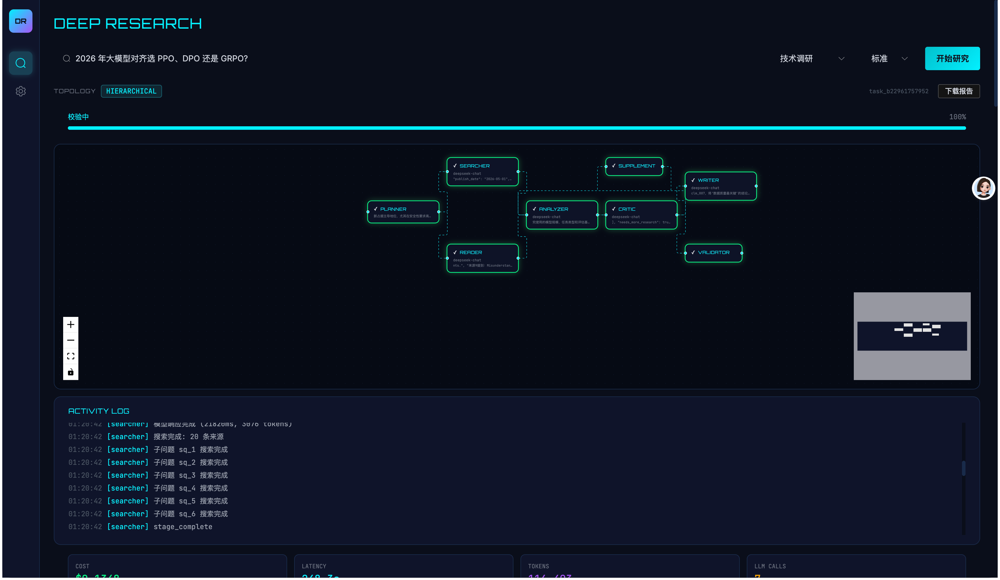

**English** | [中文](README.md)

<div align="center">

# MultiAgentIR

**Heterogeneous Model Collaborative Deep Research System**

A multi-agent intelligent retrieval and analysis framework built on FastAPI + Vue 3, featuring heterogeneous model routing, agent role decomposition, and switchable topology orchestration to automatically generate high-quality deep research reports.

[](https://www.python.org/downloads/)
[](https://fastapi.tiangolo.com/)
[](https://vuejs.org/)
[](LICENSE)

</div>

---

## System Architecture

<div align="center">
  
</div>

---

## Key Highlights

- **Heterogeneous Model Collaboration** — Agents automatically route to different models based on capability requirements; low-cost models for volume, powerful models for quality control
- **Dual Topology Orchestration** — Hierarchical topology for industry reports, Debate topology for open-ended questions, with pluggable extensibility
- **Parallel Sub-tasks** — Each sub-question gets its own Searcher/Reader instance, executed via `asyncio.gather`
- **Real-time SSE Stream** — Frontend receives Agent thinking process, token stream, and stage status in real-time via Server-Sent Events
- **Auto Repair Loop** — Validator checks report quality; if below threshold, triggers Writer repair (max 2 attempts)
- **Supplementary Search Loop** — Critic triggers supplementary search → re-analyze → re-critic when information is insufficient
- **Configuration-Driven** — Add models, agents, prompts, and topologies via YAML without modifying core code

---

## Topology Orchestration

### Topology A: Hierarchical (Industry Reports)

Suitable for structured, fact-dependent research tasks:

```
        Planner
           ↓
     SubQuestion List
           ↓
 ┌─────────┼─────────┐
 ↓         ↓         ↓
Searcher  Searcher  Searcher   ← Parallel execution
 ↓         ↓         ↓
Reader    Reader    Reader      ← Parallel execution
 └─────────┼─────────┘
           ↓
        Analyzer
           ↓
        Critic
           ↓              ← If needs_more_research, trigger supplementary search loop
        Writer
           ↓
        Validator         ← If score < 85, trigger repair loop
           ↓
      Final Report
```

### Topology B: Debate (Open-Ended Questions)

Suitable for controversial analysis, strategy selection, and non-standard-answer questions:

```
          Planner
             ↓
       Debate Questions
             ↓
 ┌───────────┼───────────┐
 ↓           ↓           ↓
Pro Agent   Con Agent   Neutral Agent   ← Parallel execution
 ↓           ↓           ↓
Evidence    Evidence    Evidence
 └───────────┼───────────┘
             ↓
          Critic
             ↓
        Synthesizer
             ↓
          Writer
             ↓
        Validator
             ↓
      Final Research Memo
```

---

## Tech Stack

| Layer | Technology | Purpose |
|-------|------------|---------|
| **Backend** | Python 3.11+ / FastAPI | API service, SSE stream, OpenAPI docs |
| | Pydantic v2 | Schema validation, config modeling |
| | httpx / asyncio | Async HTTP, parallel execution |
| | Redis | Caching, task state persistence, rate limiting |
| | tenacity | Retry, backoff, circuit breaker recovery |
| **Frontend** | Vue 3 / TypeScript | Reactive UI, type safety |
| | Pinia | State management, SSE event routing |
| | VueFlow | Topology graph visualization, node dragging |
| | Vite / TailwindCSS | Build tool, styling |
| **Config** | YAML / Jinja2 | Model registry, agent config, prompt templates |

---

## Agent Roles

| Agent | Responsibility | Model Requirement | Output |
|-------|---------------|-------------------|--------|
| **Planner** | Task understanding & decomposition | Strong reasoning | `sub_questions[]` |
| **Searcher** | Query rewriting & web retrieval | Web search | `sources[]` |
| **Reader** | Long-text reading & evidence extraction | Long context | `evidence[]`, `key_findings[]` |
| **Analyzer** | Cross-source analysis & contradiction detection | Long context | `claim_graph`, `contradictions[]` |
| **Critic** | Critical review & fact-checking | Strong reasoning | `issues[]`, `needs_more_research` |
| **Writer** | Structured research report generation | Strong writing | `final_report` |
| **Validator** | Output schema validation & quality assurance | Lightweight | `valid`, `score`, `issues[]` |

---

## Data Flow

```
1. Frontend POST /research → get task_id
2. Frontend opens SSE connection /research/{id}/stream
3. Backend ResearchService._execute() runs topology
4. Each Agent emits events via BaseAgent._emit()
5. Events pushed to frontend via SSE in real-time
6. Frontend store routes events:
   - stage_start/complete → nodeStates
   - agent_stream_token → token buffer (50ms flush)
   - report_update → result.report
   - done → final result
7. ReportViewer renders report, enables export
```

---

## Quick Start

### Prerequisites

- Python 3.11+
- Node.js 18+
- Redis (optional; falls back to in-memory cache if unavailable)

### 1. Start the Backend

```bash
cd deep_research_system

# Create virtual environment
python -m venv venv
source venv/bin/activate   # macOS/Linux

# Install dependencies
pip install -r requirements.txt

# Configure environment variables
cp .env.example .env
# Edit .env and fill in at least one model API key

# Start the server
python main.py
# or
uvicorn main:app --reload --port 8000
```

### 2. Start the Frontend

```bash
cd deep_research_system/frontend

npm install
npm run dev
```

Visit `http://localhost:3000` to use the application.

### 3. Quick Verification

```bash
# Health check
curl http://localhost:8000/api/health

# Submit a research task
curl -X POST http://localhost:8000/api/research \
  -H "Content-Type: application/json" \
  -d '{"query": "AI Agent market trend analysis 2025", "task_type": "industry_report", "depth": "quick"}'
```

---

## Project Structure

```
deep_research_system/
├── main.py                  # Backend entry point
├── .env                     # Environment variables
├── config/                  # YAML configs
│   ├── app.yaml             # App settings, cost estimates
│   ├── models.yaml          # Model registry
│   ├── agents.yaml          # Agent configs
│   └── topology.yaml        # Topology settings (max sub-questions, repair loops)
├── prompts/                 # Jinja2 prompt templates (versioned)
│   ├── planner/v3_hypothesis.zh.j2
│   ├── searcher/v4_query_planner.zh.j2
│   ├── reader/v2_atomic_facts.zh.j2
│   ├── analyzer/v2_claim_graph.zh.j2
│   ├── critic/v2_structured_critique.zh.j2
│   ├── writer/industry_report.zh.j2
│   ├── validator/v2_evidence_check.zh.j2
│   └── debate/*.zh.j2
├── app/
│   ├── api/                 # FastAPI routes
│   │   ├── routes_research.py   # POST /research, GET /research/{id}/stream
│   │   └── routes_health.py
│   ├── agents/              # Agent implementations
│   │   ├── base.py          # BaseAgent: run(), _emit(), _parse_output()
│   │   ├── planner.py       # Task decomposition
│   │   ├── searcher.py      # Web retrieval
│   │   ├── reader.py        # Evidence extraction
│   │   ├── analyzer.py      # Cross-source analysis
│   │   ├── critic.py        # Critical review
│   │   ├── writer.py        # Report generation
│   │   └── validator.py     # Quality validation
│   ├── topology/            # Topology orchestration
│   │   ├── base.py          # BaseTopology.emit()
│   │   ├── hierarchical.py  # Hierarchical topology + parallel sub-tasks + repair loop
│   │   ├── debate.py        # Debate topology
│   │   └── router.py        # Task type → topology routing
│   ├── model_pool/          # Model capability pool
│   │   ├── registry.py      # ModelRegistry: model config
│   │   ├── router.py        # FallbackRouter: capability/cost routing
│   │   ├── key_pool.py      # APIKeyPool: key management
│   │   └── client.py        # LLMClient: streaming calls
│   ├── schemas/             # Pydantic data models
│   │   ├── state.py         # ResearchState: global state
│   │   ├── task.py          # TaskSpec, TaskRequirement
│   │   └── agent_outputs.py # ClaimType, ResolutionAction
│   ├── services/            # Business services
│   │   ├── research_service.py  # Task lifecycle, SSE pub/sub
│   │   ├── search_service.py    # Tavily API wrapper
│   │   └── trace_service.py     # Audit logging
│   └── core/                # Config/logging/middleware/security
├── frontend/                # Vue 3 frontend
│   ├── src/
│   │   ├── stores/research.ts   # Pinia store: SSE event routing
│   │   ├── views/ResearchView.vue
│   │   └── components/research/
│   │       ├── TopologyGraph.vue   # VueFlow topology graph
│   │       ├── AgentNode.vue       # Node rendering
│   │       ├── DetailPanel.vue     # Agent output details
│   │       ├── ReportViewer.vue    # Report rendering
│   │       └── ProgressBar.vue     # Stage progress
│   └── package.json
├── tests/                   # Test cases
└── output/reports/          # Generated reports
```

---

## Model Configuration

The system supports heterogeneous model integration via `config/models.yaml`. Environment variables in `.env.example`:

```ini
# Slot 1: Search/Read model (low cost, long context)
MODEL_SEARCH_NAME=deepseek-chat
MODEL_SEARCH_API_KEY=sk-your-key
MODEL_SEARCH_API_BASE=https://api.deepseek.com

# Slot 2: Analysis model
MODEL_ANALYSIS_NAME=deepseek-chat
...

# Slot 3: Planning/Critic model (strong reasoning)
MODEL_REASONING_NAME=deepseek-reasoner
...

# Slot 4: Writing model (strong writing)
MODEL_WRITING_NAME=deepseek-chat
...
```

All models are accessed via API, compatible with the OpenAI interface standard, and support Chinese model providers.

---

## SSE Event Types

| Event Type | Purpose |
|------------|---------|
| `stage_start` | Agent stage started |
| `stage_complete` | Agent stage completed |
| `agent_model_selected` | Model selection notification |
| `agent_thinking` | Thinking process |
| `agent_stream_token` | Token stream (frontend 50ms buffer) |
| `agent_output` | Agent output result |
| `subtask_complete` | Sub-task completed |
| `report_update` | Intermediate report push |
| `done` | Final result |
| `error` | Error |

---

## License

MIT
